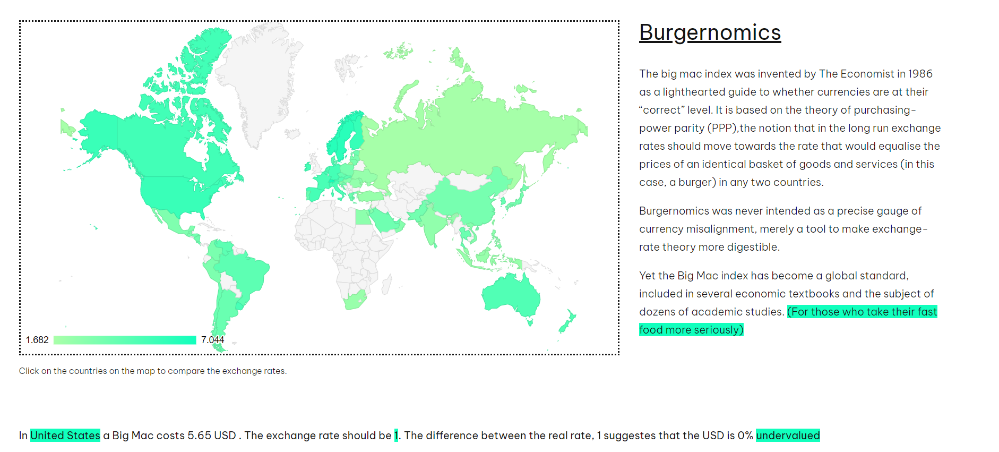

The big mac index was invented by The Economist in 1986 as a
          lighthearted guide to whether currencies are at their “correct” level.
          It is based on the theory of purchasing-power parity (PPP),the notion
          that in the long run exchange rates should move towards the rate that
          would equalise the prices of an identical basket of goods and services
          (in this case, a burger) in any two countries.

          
 This little tool helps you visualise the concept  
